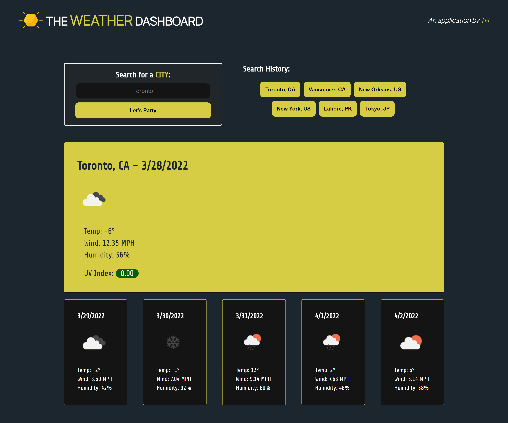

# TheWeatherDashboard
## Description

Welcome to The Weather Dashboard repository!

The link below will take you to the website hosting the application, where you will be able to retrieve important weather data for a city of your choosing!  

## Application Details

The application uses OpenWeatherMap's server-side Weather API to retrieve current and forecasted weather conditions for the relevant city. The application uses a combination of Javascript and HTML to allow user input and fetch data from the server based on it. The application's front-end is styled using a combination of CSS stylesheets and Bootstrap frameworks. Within Javascript, the fetch method is used to convert the user's city input into specified coordinates, which are fed into OpenWeatherMap's OneCall API. The Javascript dynamically displays this data to the dashboard, providing the user with the temperature, wind speed, humidity, and the current UV index.

**Languages and Libraries Used**
- HTML
- CSS
- JavaScript
- Bootstrap
- Google Fonts

**User Story:**  
AS A traveler  
I WANT to see the weather outlook for multiple cities  
SO THAT I can plan a trip accordingly  

**Acceptance Criteria:**  
GIVEN a weather dashboard with form inputs  
WHEN I search for a city  
THEN I am presented with current and future conditions for that city and that city is added to the search history  
WHEN I view current weather conditions for that city  
THEN I am presented with the city name, the date, an icon representation of weather conditions, the temperature, the humidity, the wind speed, and the UV index  
WHEN I view the UV index  
THEN I am presented with a color that indicates whether the conditions are favorable, moderate, or severe  
WHEN I view future weather conditions for that city  
THEN I am presented with a 5-day forecast that displays the date, an icon representation of weather conditions, the temperature, the wind speed, and the humidity  
WHEN I click on a city in the search history  
THEN I am again presented with current and future conditions for that city  

## Application Link and Screenshot
**Link to Application:**

[Work Day Scheduler](https://taimurhasan.github.io/TheWeatherDashboard/)

**Screenshot of Application:**
